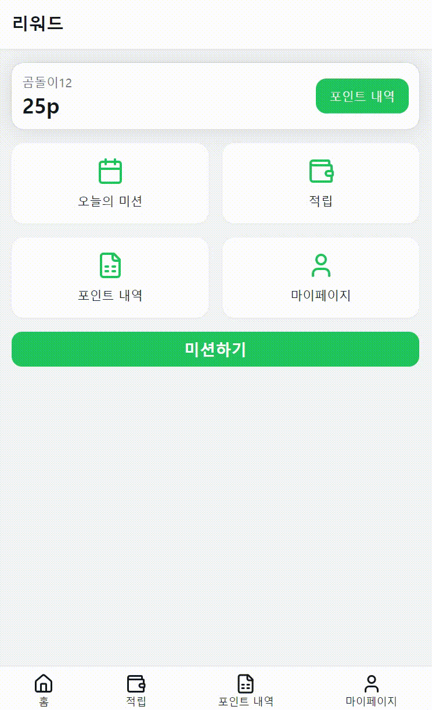
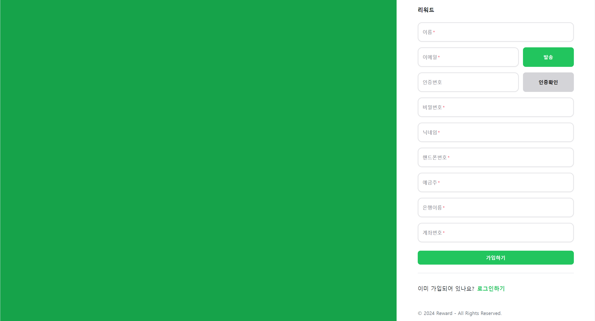
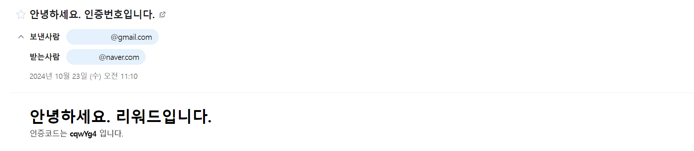
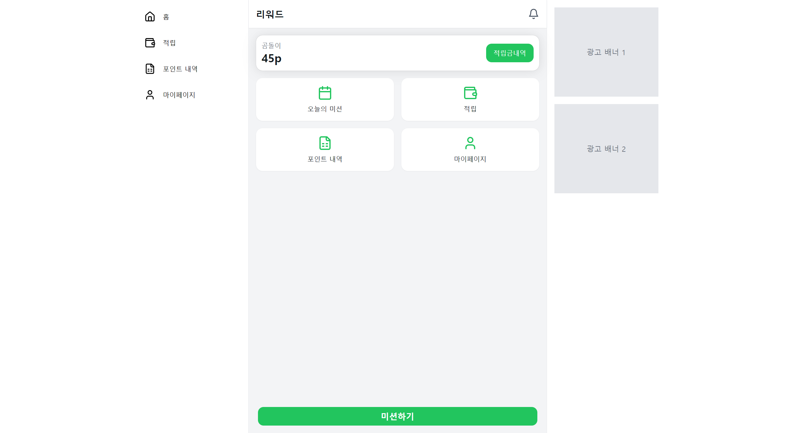
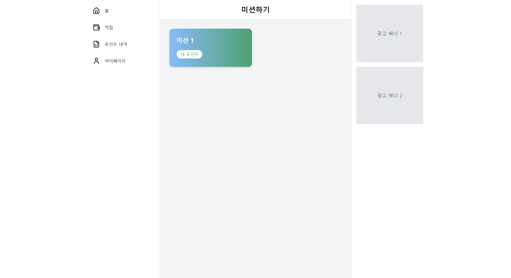
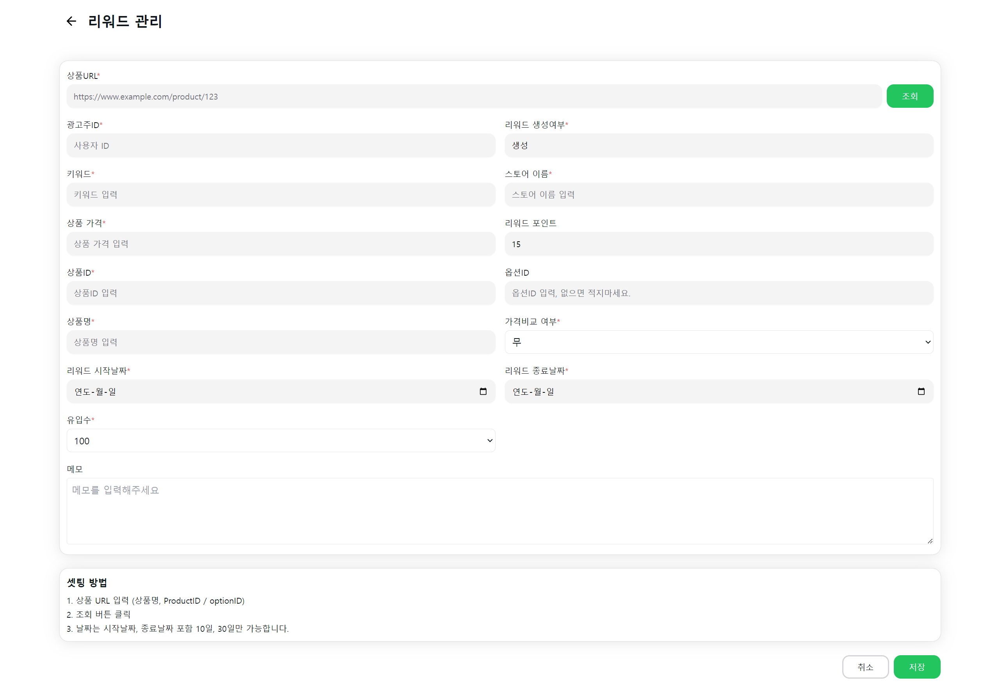
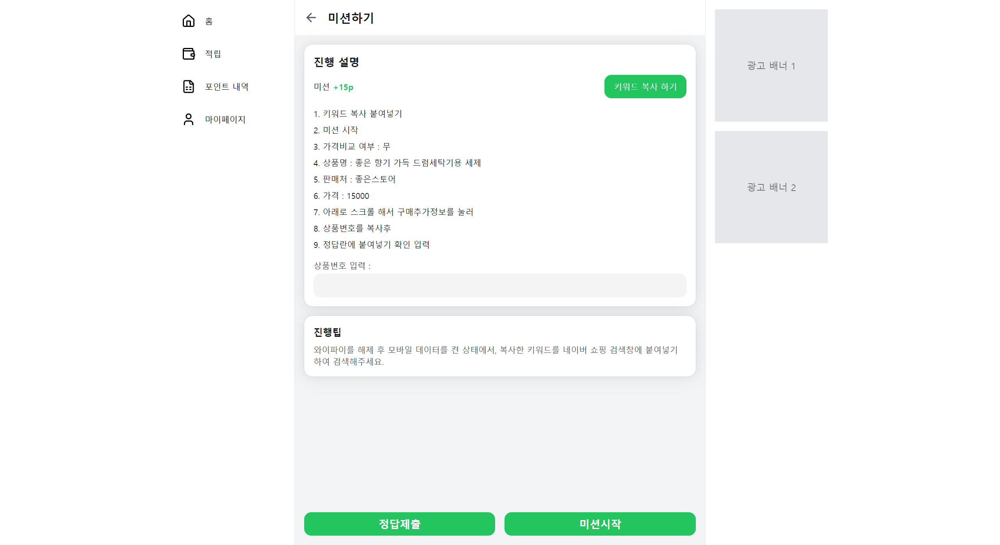
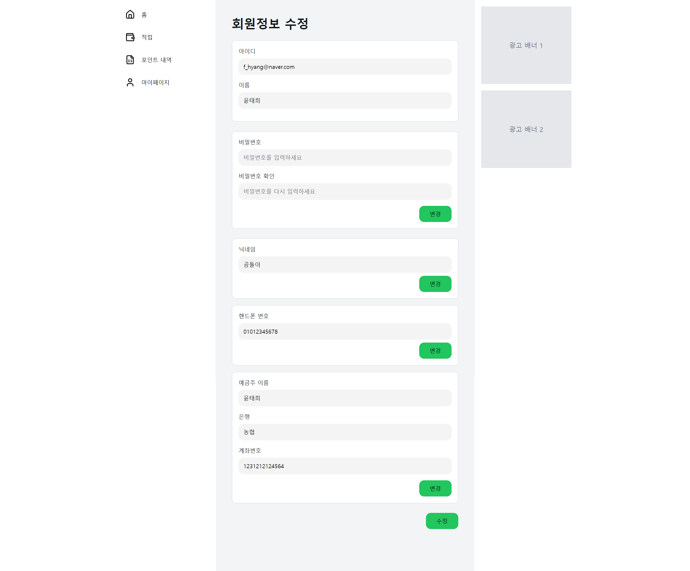

*이 프로젝트는 현재 진행 중이며, 지속적으로 개선되고 있습니다.   더 나은 기능과 성능을 위해 꾸준히 발전해 나가는 프로젝트입니다.

 
 

<h1>👋 Full-stack 1인 프로젝트 Reward</h1>

○ 개발 기간
 2024-10-01 ~ 진행 중

 

○ 소개
 온라인 쇼핑몰 판매자가 자신의 쇼핑몰을 알리기 위해 상품과 관련된 미션을 올리면 사람들은 미션을 수행하고서 포인트를 획득합니다.   온라인 쇼핑몰 판매자는 자신의 상품을 알려서 좋고, 미션 수행하는 사람들은 포인트 얻을 수 있어 좋은 서로 윈윈하는 플랫폼을 만들고자 했습니다. 

 

○ 설명
 

<strong>[Back-end]</strong>
 
▶단순한 쿼리 조회는 JPA, 복잡한 쿼리는 Mybatis를 사용.  ▶인증과 권한 관리를 위해 Spring Security와 JWT를 도입. ▶세션 방식과 JWT 방식 중 PWA와 모바일 환경에 적합한 인증 방식인 JWT를 채택함.  
<strong>[Front-end]</strong>
 ▶상태 관리를 위해 Redux 대신 간단하고 효율적인 Zustand를 채택, Axios로 서버에서 받아온 유저 데이터를 관리

   

<h2>🔻Back-end Repository</h2>

  <a href="https://github.com/YOUNTAEHEE/reward-backend">⚙️ <strong>Back-end Repository</strong></a>

 
 

<h1>💻 STACKS</h1>

<strong>IDE</strong>
  
  Front-end
   

  
  Back-end
   

   

<h2>Front-end</h2>

 

 

   

<h2>Back-end</h2>

    
  ○ DataBase
      

  
  ○ Deployment & Infrastructure
    
  
  ○ Security / Authentication & Authorization
    

   

<h1>🔎 System Architecture</h1>

  

<h1>📌 플랫폼 특징</h1>

 ▶일반 사용자/ 리워드 등록자로 구분해서 볼 수 있는 페이지 다르게 구현
 ▶회원가입시 이메일 주소 확인 인증 코드 받아서 인증할 수 있게 구현
 ▶회원정보 수정
 ▶포인트
 -리워드 등록자의 미션 등록시 포인트 차감
 -일반 사용자가 미션 성공하면 포인트 지급
 -포인트 적립, 출금 내역 확인 가능
 -포인트 적립 또는 출금시 포인트 내역 테이블에 기록됨과 동시에 유저 테이블의 총 포인트 칼럼에 기록

   

<h1>✨ 플랫폼 화면 구성</h1>

 

   

회원가입 페이지

 

회원가입 페이지에서 메일 인증 누르면 메일로 인증번호 도착  인증번호를 써넣고 인증확인 누르면 인증 성공 여부 알림창 뜸

   

일반 사용자 로그인시 첫 화면

   

미션 리스트 페이지(일반 사용자) 
날짜 지나서 종료된 미션은 보이지 않음  미션 성공한 인원이 리워드 등록자가 설정한 인원에 도달하면 미션이 종료되어 노출되지 않음

   

미션 등록 페이지(리워드 등록자) 
리워드 등록하면 포인트 차감  포인트 부족하면 리워드 등록이 안됨

   

미션하기 페이지(일반 사용자) 미션 등록하기에 등록했던 상품명, 상품가격, 가격비교 여부, 스토어 이름이 페이지에 노출  키워드는 키워드 복사하기 누르면 복사됨
 미션 성공시 포인트 지급

   

회원정보 수정 
비밀번호/닉네임/핸드폰번호/예금주,은행,계좌번호 수정 가능
 비밀번호, 은행 필드의 경우 각 필드의 변경 버튼 눌러서 수정시  필드 안의 입력란이 하나라도 비어있을 경우  수정을 할 수 없게 설정 

