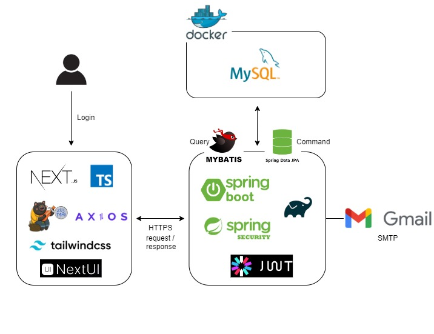

*이 프로젝트는 현재 진행 중이며, 지속적으로 개선되고 있습니다.   더 나은 기능과 성능을 위해 꾸준히 발전해 나가는 프로젝트입니다.

 
 

<h1>👋 Full-stack 1인 프로젝트 Reward 소개</h1>

온라인 쇼핑몰 판매자가 자신의 쇼핑몰을 알리기 위해 상품과 관련된 미션을 올리면 사람들은 미션을 수행하고서 포인트를 획득합니다.   온라인 쇼핑몰 판매자는 자신의 상품을 알려서 좋고, 미션 수행하는 사람들은 포인트 얻을 수 있어 좋은 서로 윈윈하는 사이트를 만들고자 했습니다. 

  

<h2>🔻Back-end Repository</h2>

  <a href="https://github.com/YOUNTAEHEE/reward-backend">⚙️ <strong>Back-end Repository</strong></a>

 
 
 

<h1>💻 STACKS</h1>

<strong>IDE</strong>
  
  Front-end
   

  
  Back-end
   

   

<h2>Front-end</h2>

 

 

   

<h2>Back-end</h2>

    
  ○ DataBase
      

  
  ○ Security / Authentication & Authorization
      

   

<h1>🔎 System Architecture</h1>

  

<h1>📌 Site Feature</h1>

▶사용자/ 리워드 등록자 페이지 구분
  ▶리워드 등록자의 미션 등록 페이지(미션 등록시 포인트 차감)
  ▶사용자가 미션하는 페이지
(미션 성공에 따라 포인트 지급)
  ▶포인트 출금/입금 내역 보는 페이지

